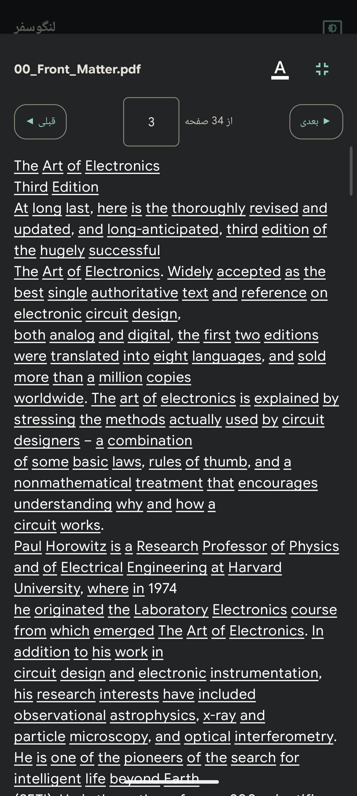
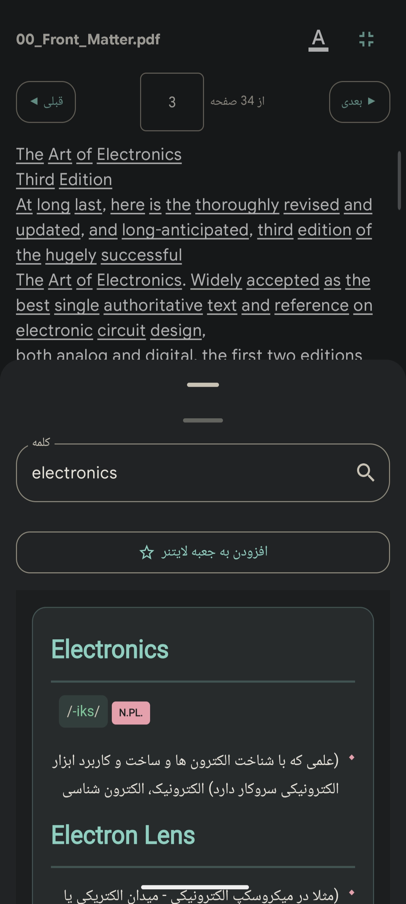
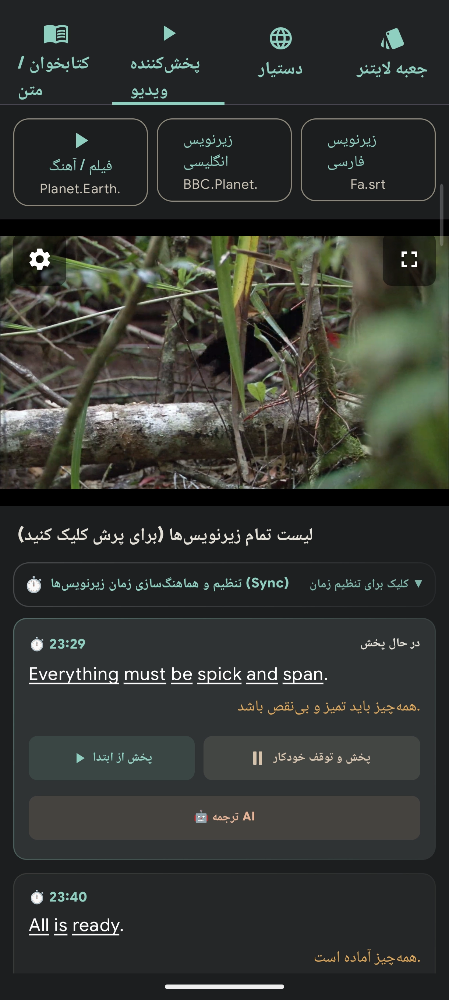
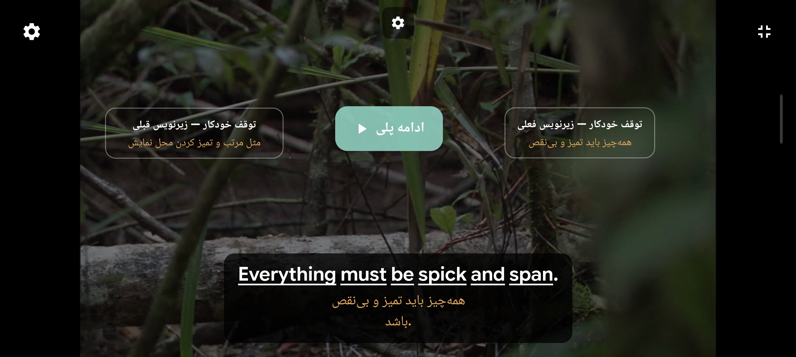
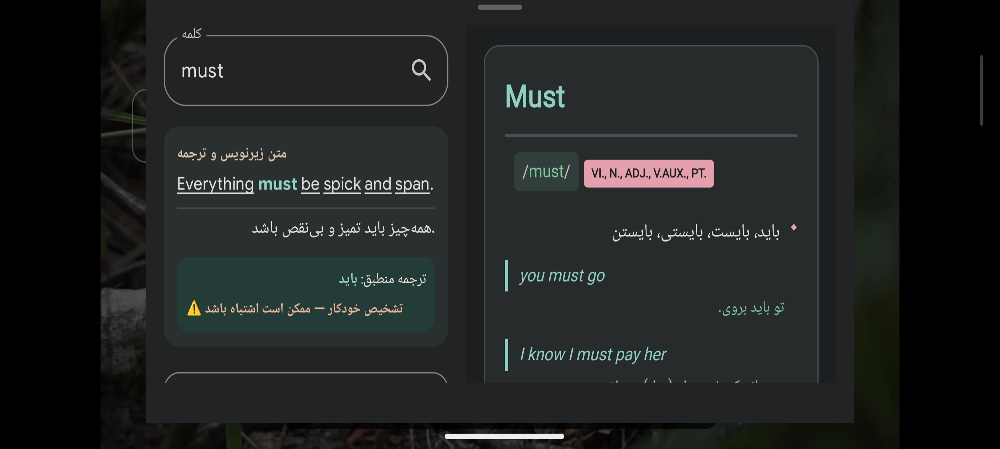
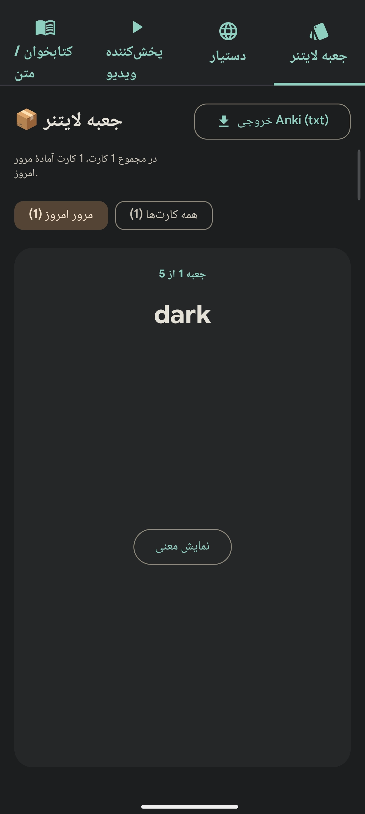
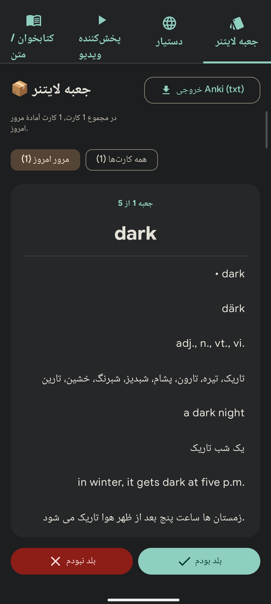

> 🌐 **خوندن به فارسی:** [فارسی](./docs/README-Fa.md)

---

## About This Project

I was always looking for an app that would help me learn languages. I had this idea in my head since I was 12 or 13, and with the rise of AI, it finally became possible for me to turn what was in my mind into reality—so that I could use it myself and also make it available to everyone completely for free.

---

## How It Works and Features

This app is suitable for people who know a little language and want to learn along with movies, songs, articles, or PDF books.

### Main Features:
* **PDF File Support:** You can open and read your desired PDF file directly from inside the app.
* **Video and Music Player:** By clicking the player tab at the top of the page, you can import your favorite video or song.
* **Synchronized Subtitles:** Selecting English subtitles and synchronized Persian subtitles; English and Persian texts are displayed simultaneously in boxes, and by **clicking on any word**, its meanings from the selected dictionary will be displayed.
* **Dictionary Support:** Support for MDict dictionary files (currently tested on the **Aryanpour Dictionary**) and `.db` database files—which I asked the AI to make something for, and if I get a database file, I will improve it accordingly so the app can read the file better.
* **Leitner Box and AnkiDroid:** Ability to add new words to the Leitner box and export directly to the **AnkiDroid** app.
* **Smart Assistant:** The assistant section currently works, and over time its issues will be fixed and improved.

### App Screenshots

<table>
  <tr>
    <td></td>
    <td></td>
    <td></td>
    <td></td>
    <td></td>
    <td></td>
    <td></td>
  </tr>
</table>

---

## Development Process and How It Was Built

I am not a programmer, and my programming knowledge is basically zero. I spent about 3 months building this app, and the development process was like this:

1. **Base and Core Structure:** Creation of the project base by **AI Studio**.
2. **Further Development:** Using a combination of Hermes + 9Router + OpenCode with the **MiMo 2.5 Free** model.
3. **Further Development again:** Using Notion's free 6-month plan, I managed to use **GLM 5.2** and **Claude 5 Sonnet** models to complete the project.

Which still has a long way to go to get better.

---

## Contact Me

To stay updated on the latest updates, report issues, or suggest your ideas, you can use the following links:

* **Telegram Channel:** [Idea_atmosphere](https://t.me/Idea_atmosphere)
* **Telegram Topic:** [Idea_atmosphere_topic](https://t.me/Idea_atmosphere_topic)
  * **General Section:** General chat
  * **Issues Section:** Report bugs and app problems
  * **Ideas Section:** Send suggestions to make the app better

---

## Acknowledgments and Thanks

* Special thanks to **mumu-lhl** and the [Ciyue](https://github.com/mumu-lhl/Ciyue) project, without which reading the `Aryanpour Dictionary.mdx` file would have been much harder.
* Thanks to **0xdolan** for the [AryanpourDictionary](https://github.com/0xdolan/AryanpourDictionary) project.

---
## License

This project is licensed under the [MIT License](LICENSE).
