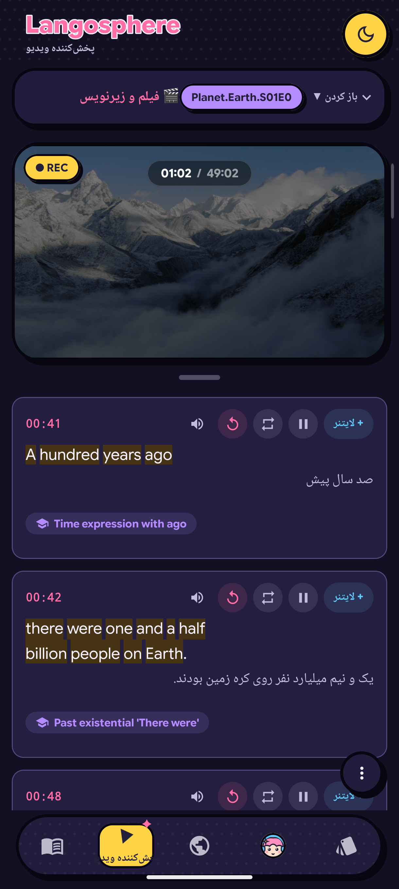
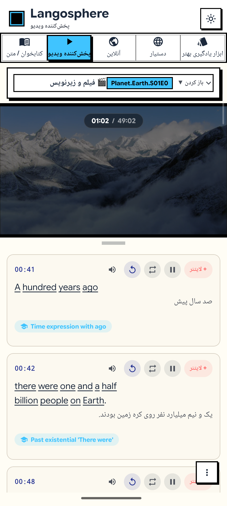
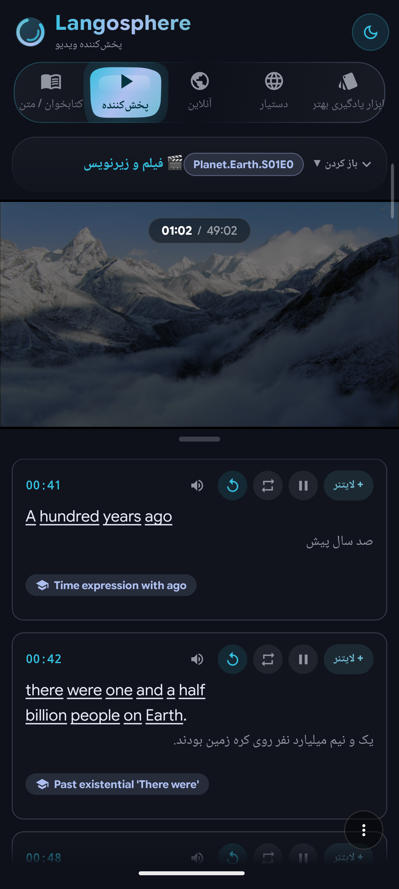
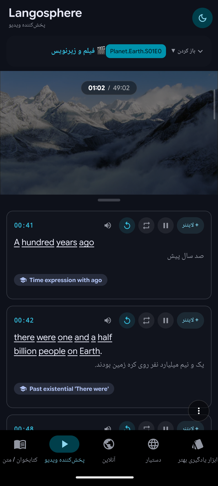
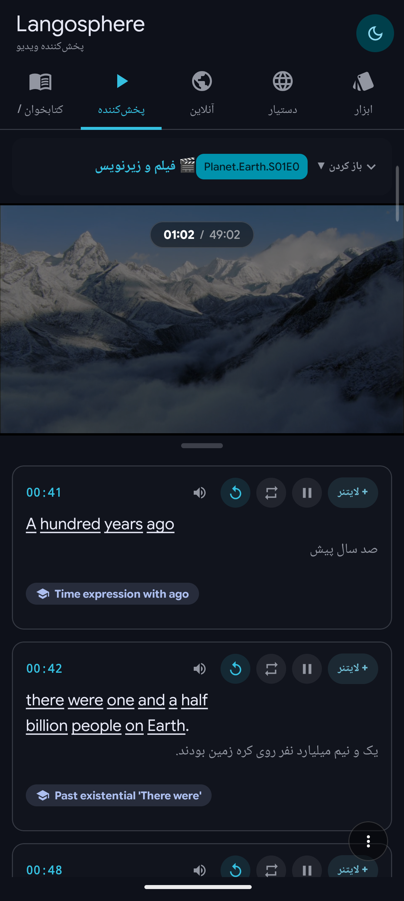

> 🌐 **Read in English:** [English](../README.md)

---

##  درباره این پروژه

من همیشه دنبال برنامه‌ای بودم که به من توی یادگیری زبان کمک کنه. این ایده از ۱۲، ۱۳ سالگی توی ذهنم بود و با ظهور هوش مصنوعی بالاخره این امکان فراهم شد تا چیزی که توی ذهنم بود رو به حقیقت تبدیل کنم؛ تا هم خودم ازش استفاده کنم و هم به صورت کاملاً رایگان در اختیار همه قرارش بدم.

---

##  نحوه کارکرد و امکانات برنامه

این برنامه برای کسایی مناسبه که کمی زبان بلدن و می‌خوان همراه فیلم، آهنگ، مقالات یا کتاب‌های PDF زبان یاد بگیرن.

###  امکانات اصلی:
* **پشتیبانی از فایل‌های PDF:** می‌تونی مستقیم از داخل برنامه فایل PDF مورد نظرت رو باز کنی و بخونی.
* **پخش‌کننده ویدیو و موزیک:** با زدن تب پخش‌کننده از بالای صفحه، ویدیو یا آهنگ دلخواهت رو وارد کنی.
* **زیرنویس همزمان:** انتخاب زیرنویس انگلیسی و زیرنویس فارسی هماهنگ‌شده؛ متون انگلیسی و فارسی همزمان در کادرها نمایش داده می‌شن و با **کلیک روی هر کلمه**، معانی اون از دیکشنریِ انتخاب شده نمایش داده می‌شه.
* **پشتیبانی از دیکشنری:** پشتیبانی از فایل‌های دیکشنری MDict (در حال حاضر روی **دیکشنری آریان‌پور** تست شده) و فایل‌های دیتابیس `.db` که اینو به هوش‌مصنوعی گفتم یچی بزنه و اگر فایل دیتابیسی گیرم اومد طبق همون بهترش می‌کنم که برنامه فایلو بهتر بتونه بخونه
* **جعبه لایتنر و AnkiDroid:** امکان اضافه کردن کلمات جدید به جعبه لایتنر و خروجی گرفتن مستقیم برای برنامه **AnkiDroid**.
* **هر جفت زبانی:** تنظیمات ◀ **پرامپت‌ها** دو کادر متن آزاد داره: زبانی که می‌خوای یاد بگیری، و زبانی که می‌خوای آموزش به اون باشه.
* **آزمون از JSON (بتا):** این تب حالا **ابزار یادگیری بهتر** است با دو گزینه‌ی مرتب: جعبه لایتنر، و آزمونی که از هر فایل آموزشیِ واردشده ساخته می‌شه. آزمون آفلاینه، از واژه‌ها، جمله‌ها و نکته‌های گرامریِ همون فایل می‌پرسه و هر واژه‌ای رو که اشتباه جواب بدی با یک ضربه به جعبه‌ی لایتنر می‌فرسته.
* **تب آنلاین (یوتیوب از طریق Invidious / Piped):** کلیپ‌ها رو از فهرست پیش‌فرض کانال‌های معلم‌های انگلیسی (BBC Learning English، English with Lucy، Rachel's English، mmmEnglish، Speak English With Vanessa و…) یا هر کانالی که دنبال می‌کنی، از طریق سرورهای آزاد Invidious/Piped پخش کن — بدون حساب گوگل و بدون هیچ SDK انحصاری. زیرنویس کلیپ توی همون پخش‌کننده‌ی «روی کلمه بزن» بارگذاری می‌شه، زیرنویس دوم رو می‌شه به‌عنوان ترجمه نشون داد، زیرنویس‌ها با یک ضربه **در کلیپ‌بورد کپی یا به‌صورت SRT/TXT ذخیره** می‌شن و می‌تونی **فایل آموزشی JSON** ساخته‌شده با هوش مصنوعی رو به کلیپ آنلاین پیوست کنی. فهرست سرورها هم قابل ویرایشه (سرور شخصی اضافه کن، سروری رو خاموش کن یا جابه‌جا کن). چون یوتیوب سرورهای عمومی رو زیاد محدود می‌کنه، وقتی هیچ سروری نتونه ویدیوهای کانالی رو فهرست کنه، فید عمومی (Atom) همون کانال فهرست رو پر می‌کنه. هر کلیپ اول **مستقیم از API داخلی یوتیوب (InnerTube)** گرفته می‌شه (همون کلاینت بدون جاوااسکریپتی که yt-dlp استفاده می‌کنه؛ فقط HTTPS، بدون کتابخونه‌ی گوگل)، پس توی پخش‌کننده‌ی خود برنامه و بدون نوار عنوان، آواتار کانال، واترمارک و کارت‌های پایانی یوتیوب پخش می‌شه و زیرنویس‌هاش به‌صورت WebVTT توی متن کامل بارگذاری می‌شن. اگه یوتیوب رد کنه، پخش خودکار بین سرورها جابه‌جا می‌شه (خطای ۴۰۳، ۵xx یا تمام‌شدن مهلت، سرور بعدی رو امتحان می‌کنه؛ تا چهار سرور)، اول جریان‌های MP4 که صدا و تصویر رو با هم دارن باز می‌شن، و اگه یوتیوب پخش مستقیم رو روی همه‌ی سرورها ببنده، ویدیو در **«پخش در حالت جایگزین»** (پخش‌کننده‌ی رسمی یوتیوب داخل WebView) پخش می‌شه و با یک شیوه‌نامه‌ی تزریق‌شده شلوغی‌های یوتیوب پنهان می‌شن و زیرنویس‌ها، جست‌وجوی کلمه و درس JSON همچنان همگام می‌مونن. زیرنویس‌ها از فهرست زیرنویس خود یوتیوب، یا در صورت نبودن، از سرورها یا timedtext یوتیوب گرفته می‌شن.
* **دستیار هوشمند:** بخش دستیار در حال حاضر کار می‌کنه و به مرور زمان مشکلاتش رفع و بهتر می‌شه.

### وضعیت قابلیت‌ها

قابلیت‌های اضافه‌شده، نیمه‌کاره و قابلیت‌های موردنیازی که هنوز اضافه نشده‌اند:

| قابلیت | وضعیت |
| --- | --- |
| کتاب‌خوان و خواندن فایل‌های PDF و EPUB | ✅ اضافه شده |
| پخش‌کننده ویدیو و موزیک (آفلاین) | ✅ اضافه شده |
| ویدیوهای آنلاین (YouTube / Invidious / Piped) | ✅ اضافه شده |
| زیرنویس همزمان دوزبانه و جست‌وجوی معنی کلمات | ✅ اضافه شده |
| پیوست درس‌های JSON (پلیر آنلاین، پلیر آفلاین و کتاب‌خوان) | ✅ اضافه شده |
| کپی زیرنویس و ذخیره به‌صورت SRT/TXT | ✅ اضافه شده |
| جعبه لایتنر | ✅ اضافه شده |
| خروجی برای AnkiDroid | ✅ اضافه شده |
| انتخاب زبان یادگیری و زبان آموزش | ✅ اضافه شده |
| آزمون آفلاین از فایل‌های آموزشی JSON | ✅ اضافه شده (بتا) |
| پنج طراحی برنامه، تنظیم رنگ، فونت و چیدمان تب | ✅ اضافه شده |
| خواندن فایل‌های دیکشنری (MDict و .db) | ⚠️ نیمه‌کاره (در حال تکمیل) |
| دستیار هوشمند | ⚠️ نیمه‌کاره (در حال تکمیل) |
| OCR آفلاین | ❌ هنوز اضافه نشده |
| مترجم آفلاین | ❌ هنوز اضافه نشده |
| TTS (تبدیل متن به گفتار) | ❌ هنوز اضافه نشده |
| حالت شدوانگ (تکرار همراه با صدای اصلی) | ❌ هنوز اضافه نشده |
| ضبط صدا و مقایسه با تلفظ اصلی | ❌ هنوز اضافه نشده |
| دیکته (تمرین شنیداری) | ❌ هنوز اضافه نشده |
| آمار و کارنامه پیشرفت و یادآور روزانه | ❌ هنوز اضافه نشده |
| بازی‌های واژگان از جعبه لایتنر | ❌ هنوز اضافه نشده |
| جست‌وجوی متن کامل در کتاب‌ها و زیرنویس‌ها | ❌ هنوز اضافه نشده |
| پشتیبان‌گیری و بازیابی اطلاعات | ❌ هنوز اضافه نشده |
| ورود دوطرفه از Anki | ❌ هنوز اضافه نشده |

###  تصاویر برنامه

<table>
  <tr>
    <td align="center"></td>
    <td align="center"></td>
    <td align="center"></td>
  </tr>
  <tr>
    <td align="center"></td>
    <td align="center"></td>
  </tr>
</table>

---

## زبان‌های طراحی

از مسیر تنظیمات ◀ پوسته ◀ **طراحی کل برنامه** می‌تونی کل ظاهر برنامه رو عوض
کنی. (پنجرهٔ پوسته حالا یک صفحهٔ فهرسته: برای «طراحی کل برنامه»، «رنگ‌های
برنامه» و «فونت» هرکدوم یک دکمه داره؛ هر بخش توی صفحهٔ خودش باز می‌شه و با
دکمهٔ «بازگشت به تم» دقیقاً به همون‌جا برمی‌گردی، پس جابه‌جایی بین بخش‌ها با
یک لمس انجام می‌شه.) پنج زبان طراحی وجود داره و هرکدوم یک سیستم بصری کامله؛
یعنی رنگ، فرم، فونت، انیمیشن و شکل اجزا با هم عوض می‌شن:

| طراحی | ظاهر |
| --- | --- |
| **Langosphere** | حالت اصلی: کارت‌های شیشه‌ای، گرادیان و نوار تب مایع. |
| **Material 3** | رنگ‌ها و اجزای استاندارد متریال گوگل. |
| **Material You** | متریال ۳ به‌همراه رنگ پویا بر اساس والپیپر. |
| **Neobrutalism** | بلوک‌های تخت، حاشیه‌های ضخیم و سایه‌های سخت. |
| **Anime (Toon)** | پوسته کاوایی/مانگا. |

##  روند توسعه و نحوه ساخت

من برنامه‌نویس نیستم و دانش برنامه‌نویسی من در حد صفره 
حدود ۳ ماه برای ساخت این برنامه وقت گذاشتم و روند توسعه به این شکل بود:

1. **پایه و ساختار اصلی:** ساخت پایه پروژه توسط **AI Studio**.
2. **ادامه توسعه:** استفاده از ترکیب Hermes + 9Router + OpenCode با مدل **MiMo 2.5 Free**.
3. **ادامه توسعه مجدد:** با استفاده از پلن ۶ ماهه رایگان Notion، موفق شدم از مدل‌های **GLM 5.2** و **Claude 5 Sonnet** برای تکمیل پروژه استفاده کنم.
که همچنان باز راه زیادی برای بهتر شدن داره

---

##  ارتباط با من

برای باخبر شدن از آخرین آپدیت‌ها، مطرح کردن مشکلات یا پیشنهادِ ایدت می‌تونی از لینک‌های زیر استفاده کنی:

*  **کانال تلگرام:** [Idea_atmosphere](https://t.me/Idea_atmosphere)
*  **تاپیک تلگرام:** [Idea_atmosphere_topic](https://t.me/Idea_atmosphere_topic)
  * بخش **General:** چت عمومی
  * بخش **Issues:** گزارش باگ‌ها و مشکلات برنامه
  * بخش **Ideas:** ارسال پیشنهادات برای بهتر شدن برنامه

---

##  قدردانی و تشکر

* تشکر ویژه از **mumu-lhl** و پروژه [Ciyue](https://github.com/mumu-lhl/Ciyue) که اگر نبود، خواندن فایل `Aryanpour Dictionary.mdx` بسیار سخت‌تر می‌شد.
* تشکر از **0xdolan** بابت پروژه [AryanpourDictionary](https://github.com/0xdolan/AryanpourDictionary).

---
## لایسنس

این پروژه تحت مجوز [MIT](../LICENSE) منتشر شده است.

